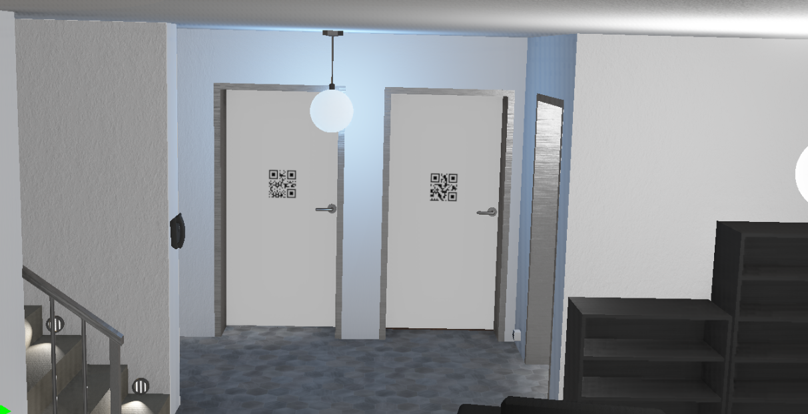
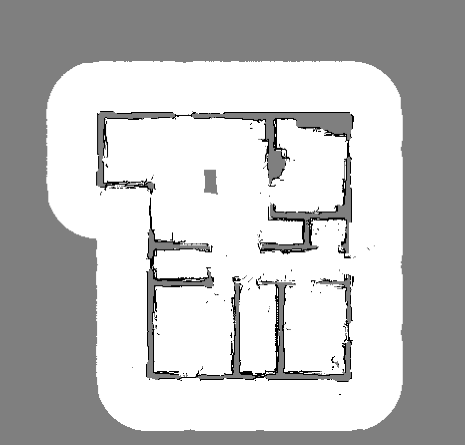
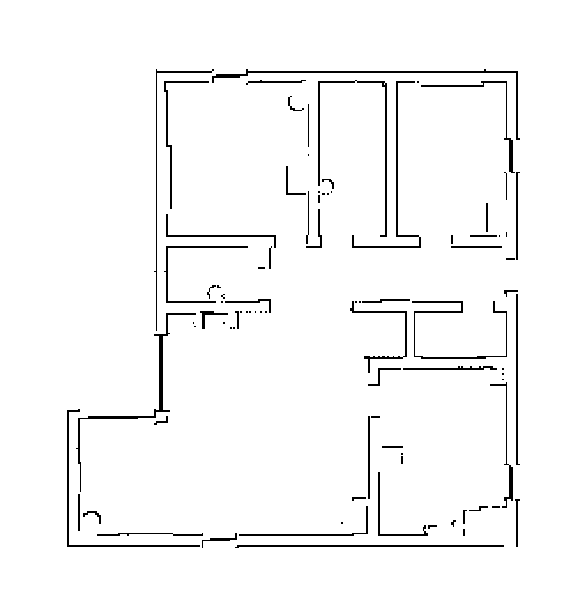

# Final Project – Indoor Mapping & Navigation

This project has **two phases** carried out in a single Webots world (`final.wbt`):

1. **Phase 1 – Aerial Mapping & Door QR indexing (Mavic 2 Pro)**  
   A Mavic performs **wall following** to sweep the apartment, builds a **2-D occupancy grid map** from range sensors while flying, and detects **QR codes on doors**, writing them into `doors.json` for later use.

2. **Phase 2 – Ground Navigation to a Door (TurtleBot Burger)**  
   A TurtleBot, **without GPS or compass**, runs **Monte-Carlo Localization (Particle Filter)** on the processed map and navigates to a requested **door** (by QR id) using local sensing and path following.

---

**Preview**

- Apartment (top view):  

- Doors & QR tags:  

- Maps: raw → processed  

  
  &nbsp;&nbsp;
  

---

## Phase 1 — Mavic Wall-Following Mapping + QR Index

- **Goal:** autonomously sweep the flat, **build an occupancy grid**, and record **door QR codes** with their positions to `doors.json`.
- **Controller:** `mavic_controller.py`
- **Key ideas:**
  - Wall-following flight to cover corridors/rooms.
  - Range-based mapping → occupancy grid saved as `point_cloud_run.pgm/.yaml`.
  - Camera-based QR detection.
- **Artifacts produced:** `doors.json`, `point_cloud_run.pgm/.yaml`.

---

## Phase 2 — TurtleBot PF Localization (No GPS/Compass) & Door Reach

- **Goal:** given a **door id** from `doors.json`, localize on the map **without GPS/compass** and drive to that door.
- **Controller:** `turtle_controller.py`
- **Sensing/inputs:** wheel **odometry** and **distance sensors** (multi-directional). No absolute pose sensors.
- **Pipeline (high level):**
  1. Load map (`occ_latest.pgm` or `point_cloud_run.pgm` + `.yaml`).
  2. **Particle Filter (MCL):** sample by odometry; score particles by comparing expected vs measured ranges (ray-casting on the grid); resample when needed.
  3. **Planning & control:** choose goal by QR id from `doors.json`, plan on free cells (e.g., A*), then track using a (v, ω) controller; re-plan if blocked.
- **Output:** console logs and the executed trajectory leading to the requested door.

---
## Robot Navigation Demo

<table>
  <tr>
    <td></td>
    <td></td>
  </tr>
  <tr>
    <td></td>
    <td></td>
  </tr>
</table>

---

## Notes

- Phase 1 uses wall-following for coverage; mapping is grid-based and saved in standard **PGM/YAML** format.
- Phase 2 demonstrates **localization from scratch** (no absolute heading/position) and goal-directed motion using only on-board sensing and the map.