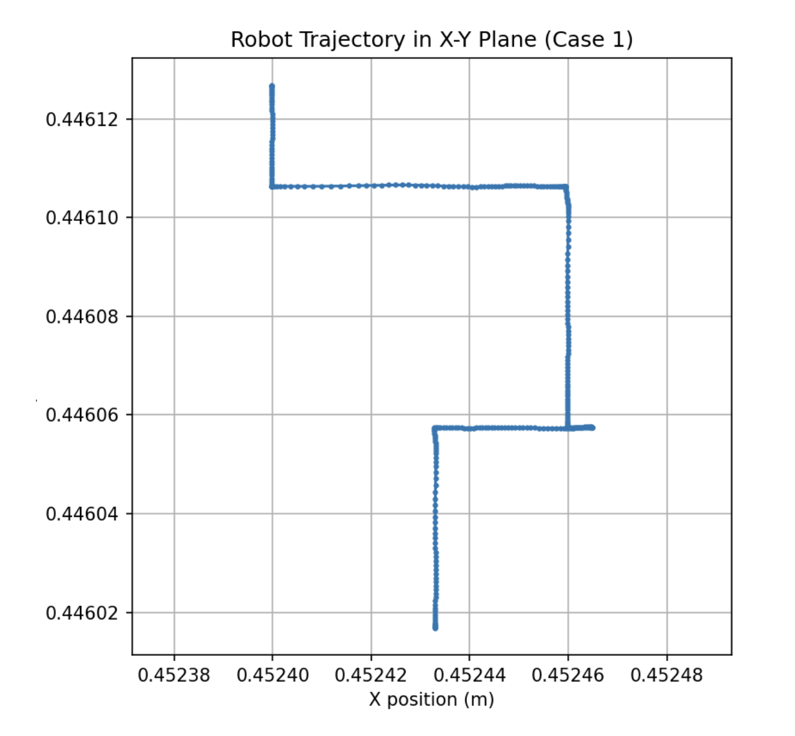
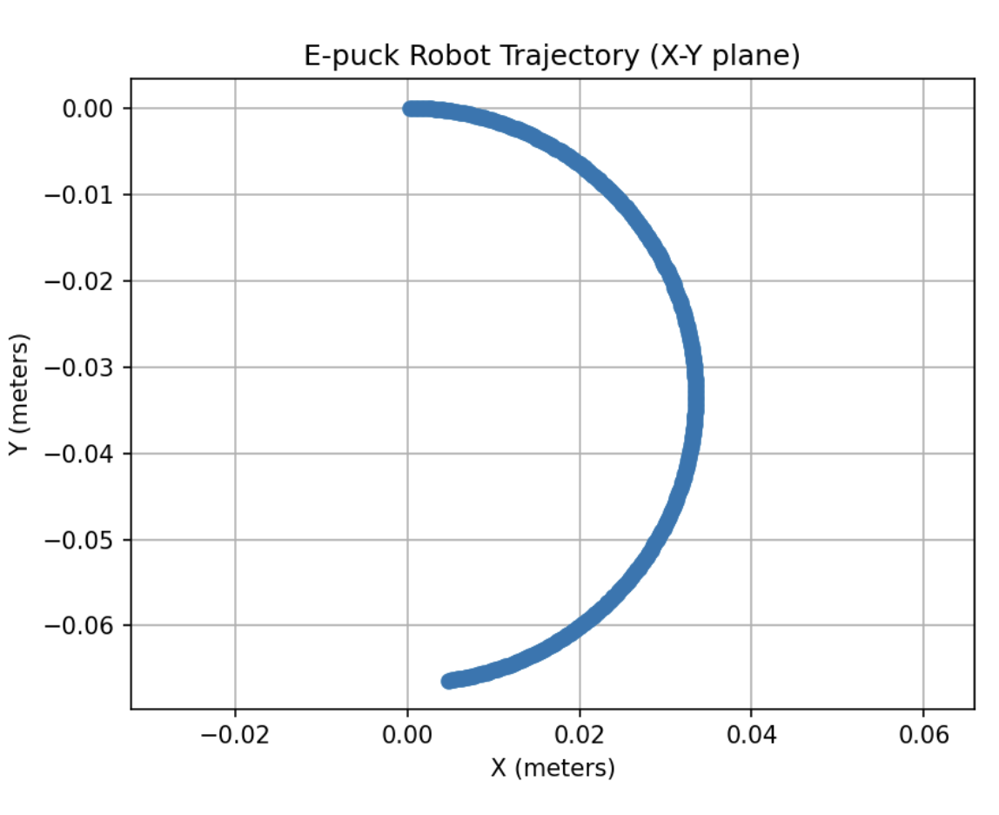
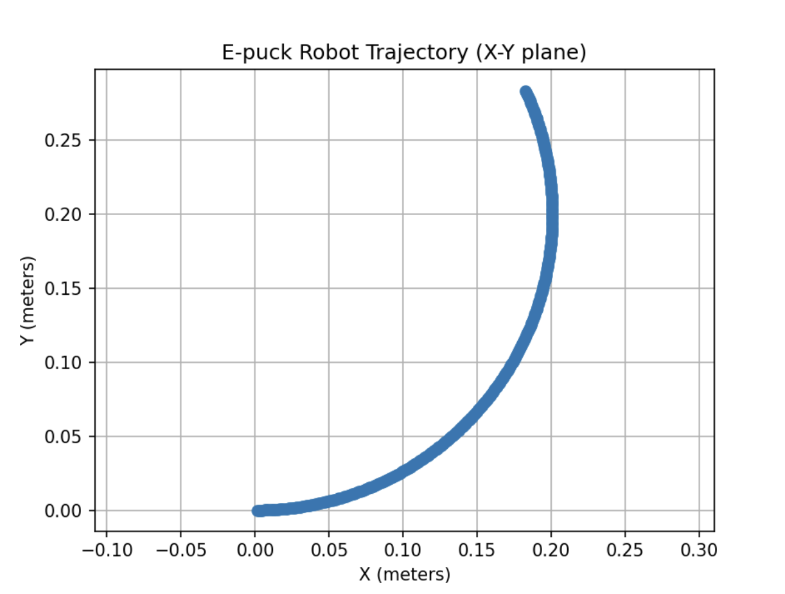

# Homework 1 – Robotics Course

This homework contains three questions related to the kinematics and control of a differential drive robot (**e-puck**).  
Each question includes the problem statement, approach, and the resulting plots.

---

## Q1 – Wheel Velocities and Trajectory
- **Problem**: Apply given angular velocities `φ₁` and `φ₂` to the robot wheels and plot the resulting trajectory.  
- **Details**:  
  - Case 1: φ₁ = 1 rad/s, φ₂ = −1 rad/s  
  - Case 2: φ₁ = cos(2t) rad/s, φ₂ = sin(−t) rad/s  
- **Goal**: Observe how different wheel speeds affect the robot’s path.  

**Resulting Plot:**  

---

## Q2 – Angle Controller
- **Problem**: Design a controller such that, given a target destination angle and using the compass sensor, the robot rotates toward the desired orientation.  
- **Goal**: Minimize error and reach the angle in the shortest possible time.  

**Resulting Plot:**  

---

## Q3 – Inverse Kinematics and Trajectory
- **Problem**: Derive the inverse kinematics model for the e-puck robot. Given a linear velocity `v` and angular velocity `ω`, compute the left and right wheel velocities. Apply them to the robot and plot the trajectory.  
- **Cases**:  
  - Case 1: v = 0.04 m/s, ω = 0.2 rad/s  
  - Case 2: v = 0.01 m/s, ω = −0.3 rad/s  
- **Goal**: Verify the motion by simulating the trajectory.  

**Resulting Plots:**  
- Case 1:  
    
- Case 2:  
  

---

## Notes
- Code for each question is available in the corresponding folder (`Q1`, `Q2`, `Q3`).  
- Plots are stored in the `figures/` subfolder.  
