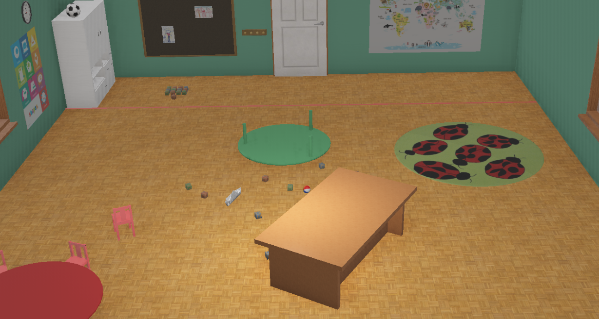
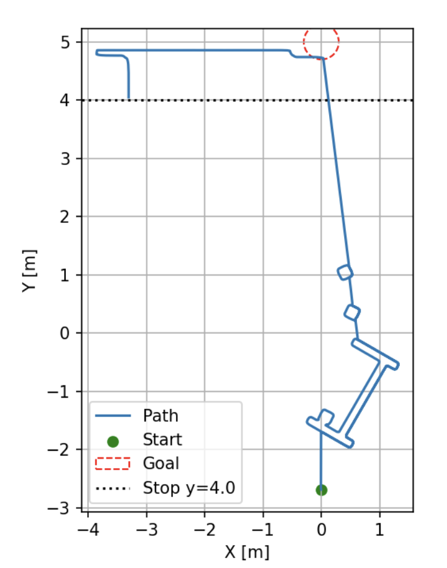
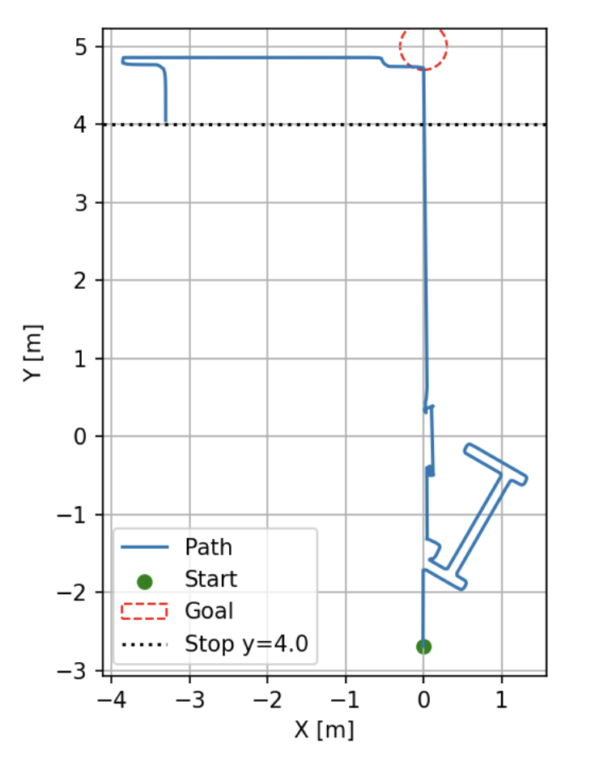

# Homework 3 – Robotics Course

This homework evaluates **local navigation** in the `kindergarten.wbt` world using the **e-puck** robot.  
**Start pose:** `(x = 0, y = −2.7)`. The robot must first reach the **door line** using a Bug algorithm and then continue to the **white cylinder** via **Wall Following**.

**Environment preview:**  

---

## Bug0 — Move-to-Goal + Wall Following

- **Problem:** Move toward the door; when an obstacle is detected, follow its boundary until the goal line is visible again, then resume straight motion. After reaching the door, switch to **Wall Following** toward the white cylinder.
- **Approach:** Straight-to-goal with a simple leave condition (first regained line-of-sight to the goal line).

**Metrics (until door)**

| Metric                | Value  |
|----------------------|--------|
| Total distance       | 9.004 m |
| Straight-line length | 7.700 m |
| Extra distance       | 1.304 m |
| Mean perp. error     | 61.7 cm |

**Resulting trajectory:**  

---

## Bug1 — Minimum-Distance Leave + Wall Following

- **Problem:** Reach the door using **Bug1** (leave the obstacle boundary at the **point of minimum distance** to the goal), then continue with **Wall Following** to the cylinder.
- **Approach:** While tracing the boundary, continuously record distance-to-goal and depart at the minimum; repeat if blocked again.

**Metrics (until door)**

| Metric                | Value   |
|----------------------|---------|
| Total distance       | 17.733 m |
| Straight-line length | 7.700 m  |
| Extra distance       | 10.033 m |
| Mean perp. error     | 53.8 cm  |

**Resulting trajectory:**  

---

## Bug2 — M-line Re-entry + **Stuck State** + Wall Following

- **Problem:** Navigate to the door using **Bug2** (leave the boundary when re-encountering the **M-line** at a point closer to the goal than the hit point).  
  Includes a **stuck state** to detect and recover from loops or dead-ends during boundary following. After the door, execute **Wall Following** to the cylinder.
- **Approach:**  
  - Follow the M-line toward the goal.  
  - On obstacle hit, trace the boundary; when the M-line is re-entered at a closer point, leave the boundary.  
  - **Stuck handling:** monitor progress/loop detection (e.g., repeated headings/positions); if stuck, perform a recovery routine (brief backup + re-enter boundary following).

**Metrics (until door)**

| Metric                | Value   |
|----------------------|---------|
| Total distance       | 13.739 m |
| Straight-line length | 7.700 m  |
| Extra distance       | 6.039 m  |
| Mean perp. error     | 34.5 cm  |

**Resulting trajectory:**  

---

## Notes

- Each `bug*.py` script runs the corresponding algorithm, prints the metrics listed above, and renders the full trajectory including the **Wall Following** phase.
- The **Bug2** implementation includes a **stuck-state** for robustness in closed or looping environments.
- Figures are stored in the `figures/` folder and linked above.

